# Reveal SDK – Data Flow Overview

This document explains **exactly what the Reveal SDK sends**, **when it sends it**, and **how data moves through the system**. It is designed for engineering, security, and risk-review teams.

---

## High-Level Architecture

**Client (SDK) → Backend (Ingest + Decision Engine) → Client (Overlay UI)**

The SDK has two responsibilities:

1. **Capture user interaction signals** (explicit events + friction events)
2. **Request contextual nudge decisions** from the backend

The Overlay has one responsibility:

- **Render plain-text nudges** chosen by the backend, with no executable code.

---

## CLIENT Boundary (SDK → Transport → Backend)

This diagram shows the **client-side architecture** and **audit-visible boundaries** within the browser. All network egress flows through a single transport module, and all data passes through sanitization guardrails before leaving the browser.

```mermaid
flowchart LR
  %% CLIENT boundary (what runs in the browser)
  subgraph CLIENT["🔒 CLIENT (Browser boundary)"]
    direction TB
    App["Host App<br/>reveal.init()<br/>reveal.track()"]
    Detectors["Detectors<br/>(Stall/RageClick/Backtrack)<br/>Auto-detect friction"]
    Pipeline["EventPipeline<br/>(enrich + batch events)"]
    Sanitizers["🔍 Guardrails<br/>scrubPII()<br/>scrubUrlPII()<br/>(flat payload rules)"]
    Decision["DecisionClient<br/>(build decision request)"]
    Transport["🌐 Transport<br/>(single network module)<br/>validate HTTPS at init<br/>sendBatch()<br/>sendDecisionRequest()"]
    Overlay["Overlay UI<br/>(render plain-text props)"]
    
    App --> Pipeline
    Detectors --> Pipeline
    Detectors --> Decision
    Pipeline --> Sanitizers --> Transport
    Decision --> Sanitizers --> Transport
    Transport --> Overlay
    Overlay --> Pipeline
  end

  %% SERVER edge (abstract, just endpoints)
  subgraph SERVER_EDGE["BACKEND (outside browser)"]
    direction TB
    Ingest["POST /ingest<br/>(EventBatch)"]
    Decide["POST /decide<br/>(DecisionRequest)"]
  end

  Transport -- "HTTPS POST /ingest<br/>EventBatch&lt;OutboundEvent[]&gt;" --> Ingest
  Transport -- "HTTPS POST /decide<br/>DecisionRequest" --> Decide
  Decide -- "200 OK<br/>NudgeDecision (plain JSON)" --> Transport

  %% Audit emphasis styling
  classDef audit fill:#fff3cd,stroke:#ff9900,stroke-width:3px,color:#111,font-weight:bold;
  class Transport,Sanitizers audit;
```



**Audit-visible components** (highlighted in yellow):
- **Transport**: Single auditable file for all network requests (`packages/client/src/modules/transport.ts`)
- **Guardrails**: PII scrubbing and URL sanitization (`packages/client/src/security/dataSanitization.ts`)

**Key flows:**
1. **Event path**: Host app / Detectors → EventPipeline → Guardrails → Transport → `/ingest`
2. **Decision path**: Detectors → DecisionClient → Guardrails → Transport → `/decide` → Overlay
3. **Interaction path**: Overlay → EventPipeline → Guardrails → Transport → `/ingest`

---

## Data Flow Diagram (High-Level Overview)


---

## What the SDK Collects

### 1. Explicit Events

Sent when developers call `Reveal.track(eventKind, eventType, payload)`.

**Payload rules:**
- Flat JSON (no nested objects)
- Primitive values only (`string`, `number`, `boolean`, `null`)
- No automatic PII collection
- Known PII keys (`email`, `phone`, `password`, `token`, etc.) are redacted by default

**Event Kinds:**
- `product` - Product events (user actions, feature usage)
- `friction` - Friction signals (auto-detected or manual)
- `nudge` - Nudge interaction events (shown, clicked, dismissed)
- `session` - Session lifecycle events (start, end)

### 2. Friction Signals (Auto-Generated)

Automatically detected friction patterns:

- **Stall events** - No user interaction for X seconds (default: 20 seconds)
- **Rage clicks** - Multiple rapid clicks on the same element (planned)
- **Backtracking** - Returning to previous step or view (planned)

**Contains:**
- `timestamp` - When the friction was detected
- `pageUrl` - Current page URL
- `selector` - CSS selector of the element (if applicable)
- `type` - Friction type: `"stall" | "rageclick" | "backtrack"`
- `extra` - Additional metadata (optional)

**Does NOT contain:**
- User text input
- Form values
- Cookies
- Tokens
- DOM content
- Screenshots

---

## What Leaves the Browser

Outbound data is strictly limited to:

```typescript
{
  projectId: string,
  sessionId: string,
  event: {
    kind: "product" | "friction" | "nudge" | "session",
    name: string,
    event_source: "sdk" | "detector" | "overlay",
    session_id: string,
    is_treatment: boolean | null,
    timestamp: number,
    // Raw location hints
    path: string | null,
    route: string | null,
    screen: string | null,
    // Derived view identifier (PII-scrubbed): route || path || screen || "unknown"
    viewKey: string,
    // Optional overlay/UI context (developer-provided, non-PII identifiers)
    ui_layer?: "page" | "modal" | "drawer" | "popover" | "unknown",
    modal_key?: string | null,
    user_agent: string,
    viewport_width: number,
    viewport_height: number,
    payload: Record<string, string | number | boolean | null>
  }
}
```

**All outbound calls go through:**
- `packages/client/src/modules/transport.ts`
  - `sendBatch()` - For event batches to `/ingest` endpoint
  - `sendDecisionRequest()` - For decision requests to `/decide` endpoint

This is the **single auditable file** for all network requests. No other file in the SDK may call `fetch`, `XMLHttpRequest`, or any network API. DecisionClient delegates HTTP requests to Transport.

---

## SERVER Boundary (Ingest → Decision Engine → Return)

This diagram shows the **server-side processing flow** from event ingestion through decision evaluation to response generation. The backend remains abstract (implementation details are not shown).


**Audit-visible boundaries** (highlighted in yellow):
- **Ingest**: Input boundary (receives all client events)
- **Normalize/Validate**: Guardrails (schema validation, data normalization)
- **Response**: Output boundary (returns only plain JSON, no executable content)

## Backend Processing Details

1. **Ingest** receives the event and attaches session context
2. **Decision Engine** checks user state + friction level
3. If needed, it returns a plain JSON nudge decision containing:
   - `nudgeId` - Unique identifier
   - `templateId` - Template type: `"tooltip" | "modal" | "banner" | "spotlight" | "inline_hint"`
   - `title` - Message title (plain text)
   - `body` - Message body (plain text)
   - `ctaText` - Call-to-action label (optional, plain text)
   - `quadrant` - Positioning quadrant: `"topLeft" | "topCenter" | "topRight" | "bottomLeft" | "bottomCenter" | "bottomRight"` (optional, defaults to "topCenter", replaces target element positioning)
   - `frictionType` - Type of friction that triggered this (optional)
   - `expiresAt` - ISO timestamp when decision expires (optional)
   - `extra` - Additional metadata (optional, flat JSON only)

**No HTML. No executable code.**

---

## What Returns to the Browser

The Overlay receives a strict JSON object:

```typescript
{
  nudgeId: string,
  templateId: "tooltip" | "modal" | "banner" | "spotlight" | "inline_hint",
  title?: string,
  body?: string,
  ctaText?: string,
  quadrant?: "topLeft" | "topCenter" | "topRight" | "bottomLeft" | "bottomCenter" | "bottomRight",
  frictionType?: "stall" | "rageclick" | "backtrack",
  expiresAt?: string,
  extra?: Record<string, string | number | boolean | null>
}
```

**Rendered via React using plain props** — no HTML injection, no `dangerouslySetInnerHTML`, no dynamic code execution.

---

## FULL DATAFLOW (Events + Transformations + Guardrails)

This sequence diagram shows the **complete end-to-end flow** with all transformations, guardrails, and the "ping-pong" request/response cycle between client and server.


**Key transformations:**
1. **Event enrichment**: EventPipeline adds metadata (session, location, viewport, user_agent, timestamps)
2. **PII scrubbing**: Guardrails redact known PII keys (`email`, `phone`, `password`, etc.) and email addresses in URLs
3. **Batching**: EventPipeline buffers events and sends in batches (periodic flush or threshold)
4. **Decision request**: Immediate path (bypasses batching) for friction signals to enable real-time nudge delivery

**Data formats:**
- **EventBatch**: `{projectId, sessionId, event: OutboundEvent[]}`
- **DecisionRequest**: `{projectId, sessionId, friction: FrictionSignal}`
- **NudgeDecision**: `{nudgeId, templateId, title?, body?, ctaText?, quadrant?, ...}`

---

## Summary of Guarantees

✅ **No automatic PII collection** - Only data explicitly passed to `Reveal.track()` is sent

✅ **No DOM scraping** - The SDK does not read or transmit DOM content, form values, or page HTML

✅ **No HTML or JS returned from the backend** - All nudge content is plain text in JSON

✅ **All network interactions flow through one auditable file** - `packages/client/src/modules/transport.ts`

✅ **All decisions rendered via safe React components** - No HTML injection, no code execution

✅ **Structured JSON only** - Both inbound and outbound data follows strict schemas

✅ **Single transport layer** - All network calls (ingest and decision requests) go through the same transport module

