# Reveal SDK – Data Flow Overview

This document explains **exactly what the Reveal SDK sends**, **when it sends it**, and **how data moves through the system**. It is designed for engineering, security, and risk-review teams.

---

## High-Level Architecture

**Client (SDK) → Backend (Ingest + Decision Engine) → Client (Overlay UI)**

The SDK has two responsibilities:

1. **Capture user interaction signals** (explicit events + friction events)
2. **Request contextual nudge decisions** from the backend

The Overlay has one responsibility:

- **Render plain-text nudges** chosen by the backend, with no executable code.

---

## CLIENT Boundary (SDK → Transport → Backend)

This diagram shows the **client-side architecture** and **audit-visible boundaries** within the browser. All network egress flows through a single transport module, and all data passes through sanitization guardrails before leaving the browser.


**Audit-visible components** (highlighted in yellow):
- **ConfigClient**: Bootstrap config fetch (uses `fetch` directly, before Transport exists) - validates endpoint URL for HTTPS
- **Transport**: Single auditable file for all network requests (`packages/client/src/modules/transport.ts`)
- **Guardrails**: PII scrubbing and URL sanitization (`packages/client/src/security/dataSanitization.ts`)

**Key flows:**
1. **Config path**: Host app → ConfigClient → `GET /config` → Backend → ClientConfig (fetched during `Reveal.init()`, before Transport is created)
2. **Event path**: Host app / Detectors → EventPipeline → Guardrails → Transport → `POST /ingest`
3. **Decision path**: Detectors → DecisionClient → Guardrails → Transport → `POST /decide` → Overlay
4. **Interaction path**: Overlay → EventPipeline → Guardrails → Transport → `POST /ingest`

---

## Data Flow Diagram (High-Level Overview)


---

## What the SDK Collects

### 1. Explicit Events

Sent when developers call `Reveal.track(eventKind, eventType, payload)`.

**Payload rules:**
- Flat JSON (no nested objects)
- Primitive values only (`string`, `number`, `boolean`, `null`)
- No automatic PII collection
- Known PII keys (`email`, `phone`, `password`, `token`, etc.) are redacted by default

**Event Kinds:**
- `product` - Product events (user actions, feature usage)
- `friction` - Friction signals (auto-detected or manual)
- `nudge` - Nudge interaction events (shown, clicked, dismissed)
- `session` - Session lifecycle events (start, end)

### 2. Friction Signals (Auto-Generated)

Automatically detected friction patterns:

- **Stall events** - No user interaction for X seconds (default: 20 seconds)
- **Rage clicks** - Multiple rapid clicks on the same element (planned)
- **Backtracking** - Returning to previous step or view (planned)

**Contains:**
- `timestamp` - When the friction was detected
- `pageUrl` - Current page URL
- `selector` - CSS selector of the element (if applicable)
- `type` - Friction type: `"stall" | "rageclick" | "backtrack"`
- `extra` - Additional metadata (optional), may include:
  - `target_id` (string) - Stable target identifier for rageclick events
  - `from_view` (string) - View identifier before navigation (for backtrack events)
  - `to_view` (string) - View identifier after navigation (for backtrack events)
  - `stall_ms` (number) - Stall duration in milliseconds (for stall events)

**Does NOT contain:**
- User text input
- Form values
- Cookies
- Tokens
- DOM content
- Screenshots

---

## What Leaves the Browser

Outbound data is strictly limited to:

```typescript
{
  projectId: string,
  sessionId: string,
  event: {
    kind: "product" | "friction" | "nudge" | "session",
    name: string,
    event_source: "sdk" | "detector" | "overlay",
    session_id: string,
    is_treatment: boolean | null,
    timestamp: number,
    // Raw location hints
    path: string | null,
    route: string | null,
    screen: string | null,
    // Derived view identifier (PII-scrubbed): route || path || screen || "unknown"
    viewKey: string,
    // Optional overlay/UI context (developer-provided, non-PII identifiers)
    ui_layer?: "page" | "modal" | "drawer" | "popover" | "unknown",
    modal_key?: string | null,
    user_agent: string,
    viewport_width: number,
    viewport_height: number,
    payload: Record<string, string | number | boolean | null>
  }
}
```

**All outbound calls go through:**
- `packages/client/src/modules/configClient.ts` (bootstrap only)
  - `getConfig()` - For config fetch to `/config` endpoint (uses `fetch` directly, before Transport exists)
- `packages/client/src/modules/transport.ts`
  - `sendBatch()` - For event batches to `/ingest` endpoint
  - `sendDecisionRequest()` - For decision requests to `/decide` endpoint

**Note:** ConfigClient uses `fetch` directly as a bootstrap exception (it must fetch config before Transport is created). ConfigClient validates the config endpoint URL for HTTPS before making requests. All other network requests go through Transport, which is the **single auditable file** for runtime network requests. DecisionClient delegates HTTP requests to Transport.

---

## SERVER Boundary (Ingest → Decision Engine → Return)

This diagram shows the **server-side processing flow** from event ingestion through decision evaluation to response generation. The backend remains abstract (implementation details are not shown).

```mermaid
flowchart LR
  subgraph SERVER["🔒 SERVER Backend Boundary"]
    direction TB
    Config["GET /config<br/>ClientConfig"]
    Ingest["POST /ingest<br/>EventBatch"]
    Normalize["Normalize/Validate<br/>(schema validation,<br/>flattening expectations)"]
    Store[("Event Store<br/>(persist events)")]
    Features["Session + Feature Builder<br/>(user state,<br/>friction level,<br/>recent events)"]
    Decide["Decision Engine<br/>(rules/ML/experiments)"]
    Response["Return<br/>NudgeDecision JSON<br/>(no HTML, no code)"]
    
    Config --> Response
    Ingest --> Normalize --> Store --> Features --> Decide --> Response
  end

  %% Client edge (abstract)
  subgraph CLIENT_EDGE["CLIENT (outside server)"]
    ConfigClient["ConfigClient"]
    Transport["Transport"]
    Overlay["Overlay UI"]
  end

  ConfigClient --> Config
  Transport --> Ingest
  Response --> Overlay

  %% Audit emphasis
  classDef audit fill:#fff3cd,stroke:#ff9900,stroke-width:3px,color:#111,font-weight:bold;
  class Config,Ingest,Normalize,Response audit;
```



**Audit-visible boundaries** (highlighted in yellow):
- **Config**: Input boundary (receives config requests, returns client-safe configuration)
- **Ingest**: Input boundary (receives all client events)
- **Normalize/Validate**: Guardrails (schema validation, data normalization)
- **Response**: Output boundary (returns only plain JSON, no executable content)

## Backend Processing Details

1. **Config** receives the config request and returns client-safe configuration (projectId, environment, SDK settings, decision endpoint/timeout, templates)
2. **Ingest** receives the event and attaches session context
3. **Decision Engine** checks user state + friction level
4. If needed, it returns a plain JSON nudge decision containing:
   - `nudgeId` - Unique identifier
   - `templateId` - Template type: `"tooltip" | "modal" | "banner" | "spotlight" | "inline_hint"`
   - `title` - Message title (plain text)
   - `body` - Message body (plain text)
   - `ctaText` - Call-to-action label (optional, plain text)
   - `quadrant` - Positioning quadrant: `"topLeft" | "topCenter" | "topRight" | "bottomLeft" | "bottomCenter" | "bottomRight"` (optional, defaults to "topCenter", replaces target element positioning)
   - `frictionType` - Type of friction that triggered this (optional)
   - `expiresAt` - ISO timestamp when decision expires (optional)
   - `extra` - Additional metadata (optional, flat JSON only)

**No HTML. No executable code.**

---

## What Returns to the Browser

### Config Response (from GET /config)

The SDK receives a `ClientConfig` object:

```typescript
{
  projectId: string,
  environment: "production" | "staging" | "development",
  sdk: {
    samplingRate: number
  },
  decision: {
    endpoint: string,  // May be relative path like "/decide" or full URL
    timeoutMs: number
  },
  templates: any[],
  ttlSeconds: number
}
```

**Note:** If `decision.endpoint` is a relative path (starts with `/`), the SDK automatically resolves it to a full URL using `apiBase` before validation and use.

### Nudge Decision (from POST /decide)

The Overlay receives a strict JSON object:

```typescript
{
  nudgeId: string,
  templateId: "tooltip" | "modal" | "banner" | "spotlight" | "inline_hint",
  title?: string,
  body?: string,
  ctaText?: string,
  quadrant?: "topLeft" | "topCenter" | "topRight" | "bottomLeft" | "bottomCenter" | "bottomRight",
  frictionType?: "stall" | "rageclick" | "backtrack",
  expiresAt?: string,
  extra?: Record<string, string | number | boolean | null>
}
```

**Rendered via React using plain props** — no HTML injection, no `dangerouslySetInnerHTML`, no dynamic code execution.

---

## FULL DATAFLOW (Events + Transformations + Guardrails)

This sequence diagram shows the **complete end-to-end flow** with all transformations, guardrails, and the "ping-pong" request/response cycle between client and server.


**Key transformations:**
1. **Config fetch**: ConfigClient fetches client-safe configuration during initialization (before Transport exists)
2. **Endpoint resolution**: Relative decision endpoints from backend config are resolved to full URLs using `apiBase`
3. **Event enrichment**: EventPipeline adds metadata (session, location, viewport, user_agent, timestamps)
4. **PII scrubbing**: Guardrails redact known PII keys (`email`, `phone`, `password`, etc.) and email addresses in URLs
5. **Batching**: EventPipeline buffers events and sends in batches (periodic flush or threshold)
6. **Friction event immediate flush**: Friction events trigger immediate flush (bypasses batch threshold) to preserve causality and ensure friction events are stored before nudge events
7. **Event ordering**: During batch flush, events are sorted so friction events always precede nudge events (defensive measure)
8. **Decision request**: Immediate path (bypasses batching) for friction signals to enable real-time nudge delivery
9. **Eligibility checks**: Backend may query recent `nudge_shown` events per session to enforce cooldowns and per-session caps before returning a nudge decision

**Data formats:**
- **ClientConfig**: `{projectId, environment, sdk: {samplingRate}, decision: {endpoint, timeoutMs}, templates, ttlSeconds}`
- **EventBatch**: `{projectId, sessionId, event: OutboundEvent[]}`
- **DecisionRequest**: `{projectId, sessionId, friction: FrictionSignal}`
- **NudgeDecision**: `{nudgeId, templateId, title?, body?, ctaText?, quadrant?, ...}`

---

## Summary of Guarantees

✅ **No automatic PII collection** - Only data explicitly passed to `Reveal.track()` is sent

✅ **No DOM scraping** - The SDK does not read or transmit DOM content, form values, or page HTML

✅ **No HTML or JS returned from the backend** - All nudge content is plain text in JSON

✅ **All network interactions flow through one auditable file** - `packages/client/src/modules/transport.ts` (runtime requests). ConfigClient uses `fetch` directly as bootstrap exception (validates endpoint URL before requests).

✅ **All decisions rendered via safe React components** - No HTML injection, no code execution

✅ **Structured JSON only** - Both inbound and outbound data follows strict schemas

✅ **Single transport layer** - All network calls (ingest and decision requests) go through the same transport module

✅ **Config fetch is secure** - ConfigClient validates endpoint URL for HTTPS before fetching, falls back gracefully if fetch fails
